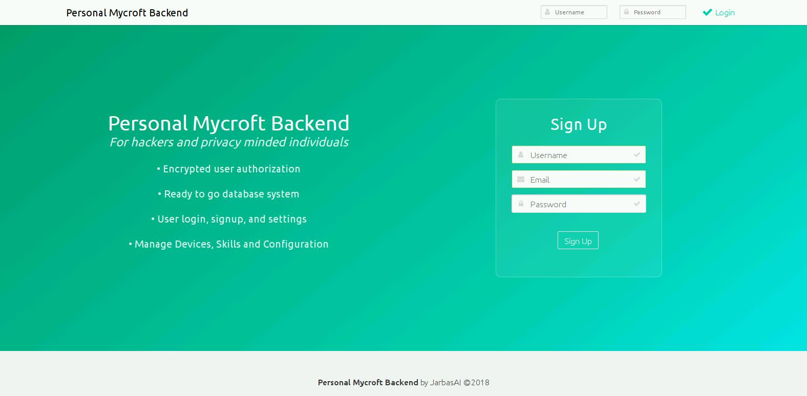

# Mycroft Backend

Personal mycroft backend alternative to mycroft.home, written in flask

# UNDER CONSTRUCTION

you can run it, but why would you before it's finished?

Pull Requests welcome

## Install

from source

    git clone https://github.com/MycroftAI/personal-backend
    cd personal-backend
    pip install .

from pip

    pip install personal-mycroft-backend
    
configure backend by editing/creating ~/.mycroft/personal_backend/personal_backend.conf

    {
    "backend_port": 6712,
    "website_port": 5000,
    "ssl": true,
    "ssl_key": "/home/user/.mycroft/personal_backend/certs/MycroftPersonalServer.key",
    "ssl_cert": "/home/user/.mycroft/personal_backend/certs/MycroftPersonalServer.crt",
    "mail_port": 465,
    "mail_server": "smtp.googlemail.com",
    "mail_user": "xxx@gmail.com",
    "mail_password": "xxx",
    "secret_key": "MY_PRECIOUS_SECRET_KEY",
    "salt": "MY_TABLE_SALT"
    }

change url in "server" section in your default mycroft config

     // Address of the REMOTE server
      // Override: none
      "server": {
        "url": "https://0.0.0.0:6712",
        "version": "v0.1",
        "update": true,
        "metrics": true
      },

## usage

start backend 

    from personal_mycroft_backend.backend import start_backend
    
    start_backend()

start frontend

    from personal_mycroft_backend.frontend import start_frontend
    
    start_frontend()
    
more examples [here](https://github.com/MycroftAI/personal-backend/tree/master/examples)

## Features / Routes

- get location

- geoip location default

- get config

- get device settings

- patch device settings

- pairing process

- send mail

- multiple STT engines supported (google, wit, ibm, kaldi, bing, houndify, govivace, deepspeech)

- sql database

- user email confirmation

- local browserless GUI if running on same machine

- website (status: WIP)

- store metrics (WIP - integrating into frontend, sql db and api endpoints functional)

# TODOS

- most of the frontend, are you a web dev? team up with me!

- STT json settings in db (for google cloud stt engine)

- skill settings

- wakeword upload

- wolfram alpha api

- weather api

- local data storage (audio recordings)

- if opt in proxy data to mycroft (utterances/hotwords/metrics)

- everything else i forgot

- new functionality
    - mimic 1 remote TTS 
    - user voice print from uploaded utterances / wakewords
    - train precise/snowboy models

# Credits

Thanks goes out to JarbasAI for creating this initial implementation. You can find the archived [original repo here](https://github.com/JarbasAl/ZZZ_personal-mycroft-backend).

